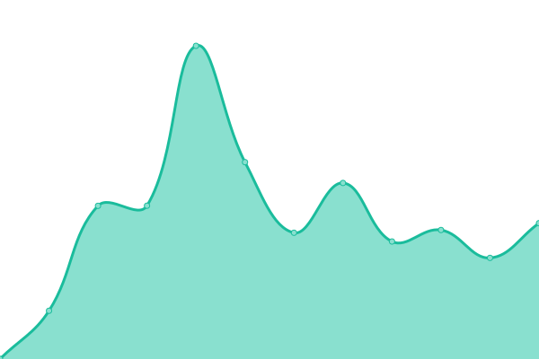
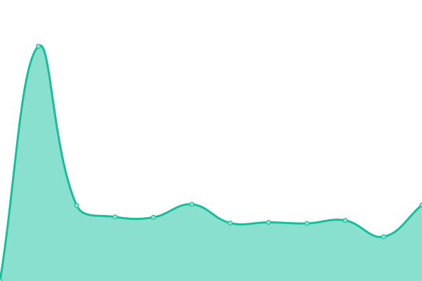
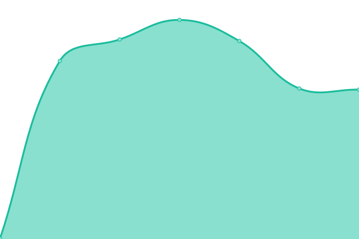
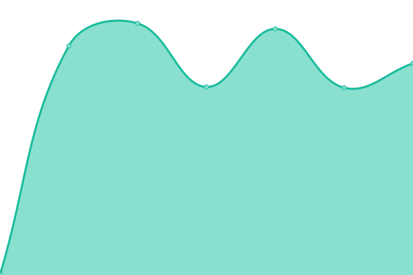
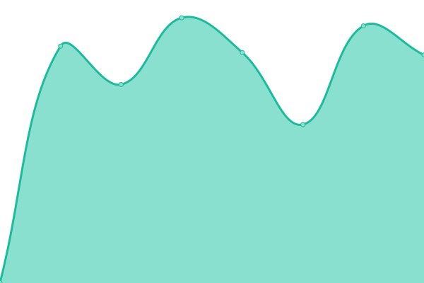
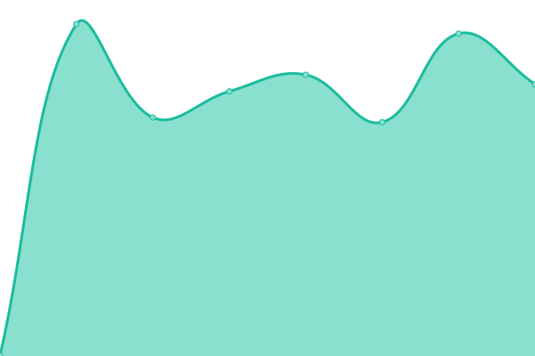

# [📈 Live Status](https://status.eriga.io): <!--live status--> **🟩 All systems operational**

This repository contains the open-source uptime monitor and status page for [erigaio](https://status.eriga.io), powered by [Upptime](https://github.com/upptime/upptime).

With [Upptime](https://upptime.js.org), you can get your own unlimited and free uptime monitor and status page, powered entirely by a GitHub repository. We use [Issues](https://github.com/erigaio/uptime/issues) as incident reports, [Actions](https://github.com/erigaio/uptime/actions) as uptime monitors, and [Pages](https://status.eriga.io) for the status page.

<!--start: status pages-->
<!-- This summary is generated by Upptime (https://github.com/upptime/upptime) -->
<!-- Do not edit this manually, your changes will be overwritten -->
<!-- prettier-ignore -->
| URL | Status | History | Response Time | Uptime |
| --- | ------ | ------- | ------------- | ------ |
|  [API](https://api.eriga.io/health/deep) | 🟩 Up | [api.yml](https://github.com/erigaio/uptime/commits/HEAD/history/api.yml) | 

 1369ms
     
 | 

<a href="https://status.eriga.io/history/api">97.53%</a>
    

|  [AI](https://ai.eriga.io/health/deep) | 🟩 Up | [ai.yml](https://github.com/erigaio/uptime/commits/HEAD/history/ai.yml) | 

 510ms
     
 | 

<a href="https://status.eriga.io/history/ai">100.00%</a>
    

|  [MCP](https://mcp.eriga.io/health/deep) | 🟩 Up | [mcp.yml](https://github.com/erigaio/uptime/commits/HEAD/history/mcp.yml) | 

 809ms
     
 | 

<a href="https://status.eriga.io/history/mcp">98.46%</a>
    

|  [App](https://app.eriga.io) | 🟩 Up | [app.yml](https://github.com/erigaio/uptime/commits/HEAD/history/app.yml) | 

 388ms
     
 | 

<a href="https://status.eriga.io/history/app">100.00%</a>
    

|  [Site](https://eriga.io) | 🟩 Up | [site.yml](https://github.com/erigaio/uptime/commits/HEAD/history/site.yml) | 

 617ms
     
 | 

<a href="https://status.eriga.io/history/site">100.00%</a>
    

|  [Docs](https://doc.eriga.io) | 🟩 Up | [docs.yml](https://github.com/erigaio/uptime/commits/HEAD/history/docs.yml) | 

 498ms
     
 | 

<a href="https://status.eriga.io/history/docs">100.00%</a>
    

|  [Dev docs](https://dev.eriga.io) | 🟩 Up | [dev-docs.yml](https://github.com/erigaio/uptime/commits/HEAD/history/dev-docs.yml) | 

 650ms
     
 | 

<a href="https://status.eriga.io/history/dev-docs">100.00%</a>
    

<!--end: status pages-->

[**Visit our status website →**](https://status.eriga.io)

## 📄 License

- Powered by: [Upptime](https://github.com/upptime/upptime)
- Code: [MIT](./LICENSE) © [Anand Chowdhary](https://anandchowdhary.com), supported by [Pabio](https://pabio.com)
- Data in the `./history` directory: [Open Database License](https://opendatacommons.org/licenses/odbl/1-0/)
